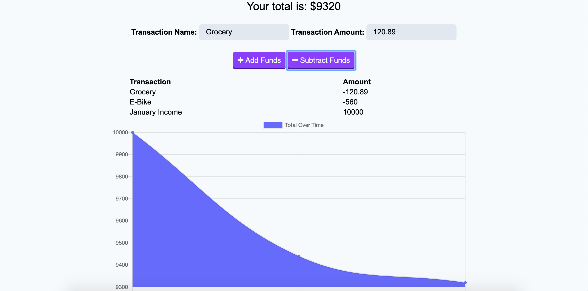

# Budget Tracker
The user will be able to add expenses and deposits to their budget with or without a connection. When entering transactions offline, they should populate the total when brought back online. Progressive Web App features (manifest, service-worker, IndexedDB)
Deployed app via heroku: https://budget-tracker-app-2020.herokuapp.com/

## User Story
AS AN avid traveller
I WANT to be able to track my withdrawals and deposits with or without a data/internet connection
SO THAT my account balance is accurate when I am traveling

## Business Context
Giving users a fast and easy way to track their money is important, but allowing them to access that information anytime is even more important. Having offline functionality is paramount to our applications success.

## Technologies
* HTML
* CSS
* Bootstrap
* JS
* Node.js
* Express.js
* Compression
* Mongoose
* Morgan

## Installation
1. On GitHub, navigate to the main page of the repository.
2. Under the repository name, click Clone or download.
3. To clone the repository, click "Clone with HTTPS".
4. Open Terminal.
5. Change the current working directory to the location where you want the cloned directory to be made.
6. Type git clone, and then paste the URL you copied in Step 2.
7. Press Enter. Your local clone will be created.
8. After installation, open node, navigate to the file and run npm install.
9. Please Ensure that You Have a Local Database Connected to the app.
## Authors
Lilliana Ramos